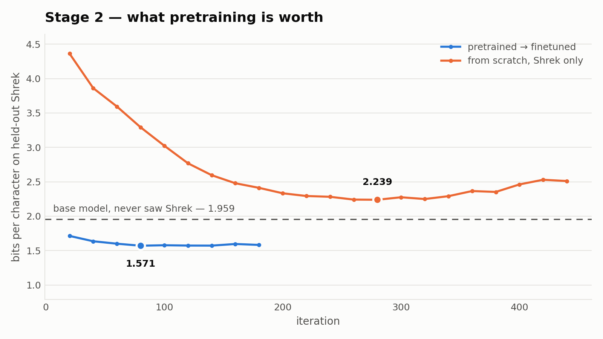
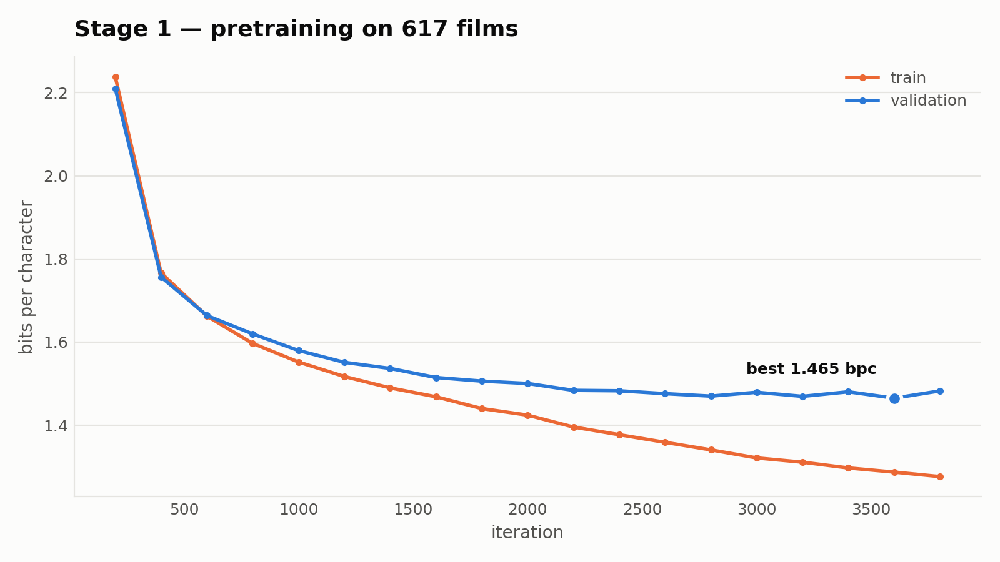

# Tiny-Shrek

A 14.2M-parameter Llama-style transformer trained from scratch on movie dialogue,
then finetuned onto a single film's characters. No pretrained weights anywhere —
the architecture, both training stages and every evaluation are in this repo.

## Headline result

Three checkpoints, identical architecture, scored on the same 200 held-out windows
of Shrek dialogue:

| checkpoint | saw Cornell | saw Shrek | bits/char | ppl |
|---|---|---|---|---|
| `pretrain` | 19M tokens | — | 1.9588 | 3.89 |
| **`finetune`** | 19M tokens | 105k tokens | **1.5868** | **3.00** |
| `scratch` | — | 105k tokens | 2.2532 | 4.77 |

- Finetuning is worth **19.0%** bits/char over the base model.
- Pretraining is worth **29.6%** — same architecture, same Shrek data, same budget.
- **A model that has never seen a word of Shrek beats one trained exclusively on
  Shrek, by 13%.** With only 105k target-domain characters, general dialogue
  competence transfers better than memorising the target.



The finetuned run sits below the dashed base-model line from its first evaluation.
The from-scratch run spends 440 iterations climbing toward that line and never
reaches it.

## Architecture

`model.py`, ~250 lines: RoPE · RMSNorm · SwiGLU · no biases · tied embeddings ·
flash attention via SDPA. 8 layers, 6 heads, 384 embedding, 512 context,
character-level over a 93-char vocabulary.

`python model.py` self-checks the parameter count, verifies init loss against
`ln(vocab)` (an untrained model must be exactly as uncertain as a uniform guess),
and asserts cached and uncached generation produce identical tokens.

## Data

| stage | source | train | val |
|---|---|---|---|
| 1 | Cornell Movie-Dialogs, 617 films | 19,227,467 chars | 292,741 |
| 2 | Shrek 1–3 screenplays, 2,106 exchanges | 105,154 chars | 16,282 |

Validation holds out **whole movies** and whole scenes. A random-line split leaks
context across the boundary and reports optimistically.

Screenplays are parsed heuristically (`ALL-CAPS` line = speaker, indented lines
below = dialogue) into `NAME: dialogue`, which gives character conditioning for
free — prompt with `SHREK:` and it generates in character, no architectural change.

## Training

Stage 1: 4,000 iters at 32,768 tokens/step (6.8 epochs), LR 6e-4 cosine with
warmup, AdamW(0.9, 0.95), weight decay on 2-D params only, grad clip 1.0, bf16.
**655s on one L4** at 0.164 s/iter — `torch.compile` was worth 1.6x over 0.26
uncompiled. Best val **1.4654 bpc**.



Stage 2: LR 3e-5, batch 8, 15% stage-1 replay mixed in to prevent the model
forgetting general English. Best val at iter 80 (~3 epochs); early stopped at 180.

The ablation gets a *more* generous budget than the finetune (1,000 iters,
patience 8) so the comparison isn't rigged. It bottomed at ~11 epochs and ended at
train 0.72 / val 1.74 — a generalisation gap of **1.02**, against 0.29 for the
finetune. Without stage 1 there is nothing to do but memorise.

## Memorisation audit

20 samples × 400 characters, verbatim k-gram overlap against both training corpora:

| | 10-gram | 20-gram | 40-gram |
|---|---|---|---|
| vs Cornell (19.2M chars) | 69.12% | 5.79% | **0.00%** |
| vs Shrek (105k chars) | 22.99% | 0.76% | **0.00%** |

Zero 40-gram overlap: nothing approaching quotation length is being recited. The
69% 10-gram figure is not memorisation — ten characters is `" the same"`, and a
19M-char corpus contains nearly every common one. Small models on small corpora do
recite, so this is measured rather than assumed before shipping a public demo.

## KV cache

`sample.py --bench`, 512 tokens, warmed up and `cuda.synchronize()`'d:

| batch | no cache | cache | speedup |
|---|---|---|---|
| 1 | 130 t/s | 133 t/s | 1.02x |
| 8 | 664 t/s | 1088 t/s | 1.64x |
| 32 | 705 t/s | 4166 t/s | 5.91x |
| 64 | 627 t/s | 7081 t/s | **11.29x** |

The batch-1 row is the interesting one. A 14M model generating one sequence is
**launch-bound**, not compute-bound: ~100 small CUDA kernels per token in eager
mode, ~7.7ms per token, of which the attention work the cache eliminates is ~0.25ms.
Hence 1.02x. Batching amortises the per-step overhead until attention is genuinely
the bottleneck — at which point the uncached path saturates the GPU at ~650 t/s
while the cached path scales nearly linearly. Per sequence, cached throughput
barely degrades from batch 1 to 64 (133 → 110 t/s), so it is *still* overhead-bound
at 64 and the speedup would keep climbing.

## Samples

Base model, stage 1 only — correct dialogue form, no semantic thread, and it has
learned per-character vocabulary (KORBEN co-occurs with "Shu", from The Fifth
Element):

```
BIANCA: Wanna know where Shu is?
KORBEN: Shu Korben.
BIANCA: Put the key in a bowling pool trunk.
KORBEN: You missed Casablanca.
```

After finetuning, seeded with two lines of context:

```
SHREK: What are you doing in my swamp?
DONKEY: I'm all alone, there's no one here beside me.
SHREK: Come on in, come on in. I can't do it anymore. I'm on the top of my swamp.
DONKEY: Well, it's a little late. Not my swamp. This is my first memory.
```

## Context is load-bearing

An unseeded `SHREK: ` prompt drifts back to generic Cornell characters within a few
turns; two lines of real dialogue pin it to the Shrek universe for the whole
generation. Stage 1 saw ~131M tokens and stage 2 only ~278k, so the pretraining
distribution dominates unless the context says otherwise. The demo seeds by default.

This also means teacher-forced perplexity and generative style fidelity are not the
same objective — the finetuned model wins clearly on the first while still needing
help on the second.

## Reproducing

```bash
python prepare.py cornell
python train.py --stage pretrain --out_dir $CKPT --compile
python prepare.py shrek --inspect     # eyeball the parse before committing to it
python prepare.py shrek
python train.py --stage finetune --out_dir $CKPT
python train.py --stage scratch --out_dir $CKPT-ablation
python eval.py --split shrek_val --ckpt $CKPT/pretrain.pt --ckpt $CKPT/finetune.pt \
                                 --ckpt $CKPT-ablation/scratch.pt
python eval.py --ckpt $CKPT/finetune.pt --memorize
python sample.py --ckpt $CKPT/finetune.pt --bench
python plot.py --logs $CKPT --out figures
```

Total GPU cost: about 15 minutes on one L4.

## Limits

It generates in-character dialogue; it is not a chatbot and will not answer
questions. At 14M parameters output is locally coherent and stylistically right but
not semantically grounded across turns — `SHREK: Shut up. / DONKEY: Shut up.` is a
representative failure. That is the ceiling at this scale, not a training defect.

Corpora are not committed: Cornell Movie-Dialogs carries its own distribution terms
and the screenplays are copyrighted.
